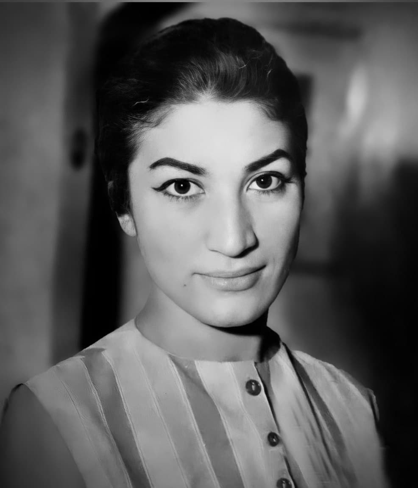
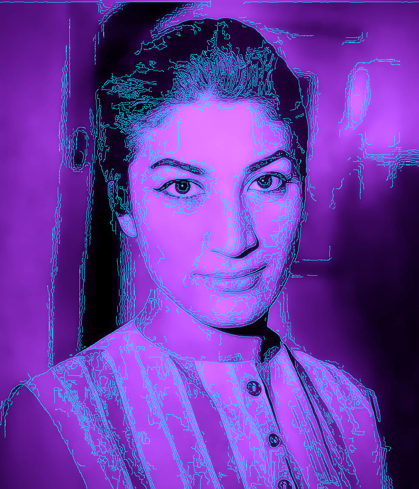
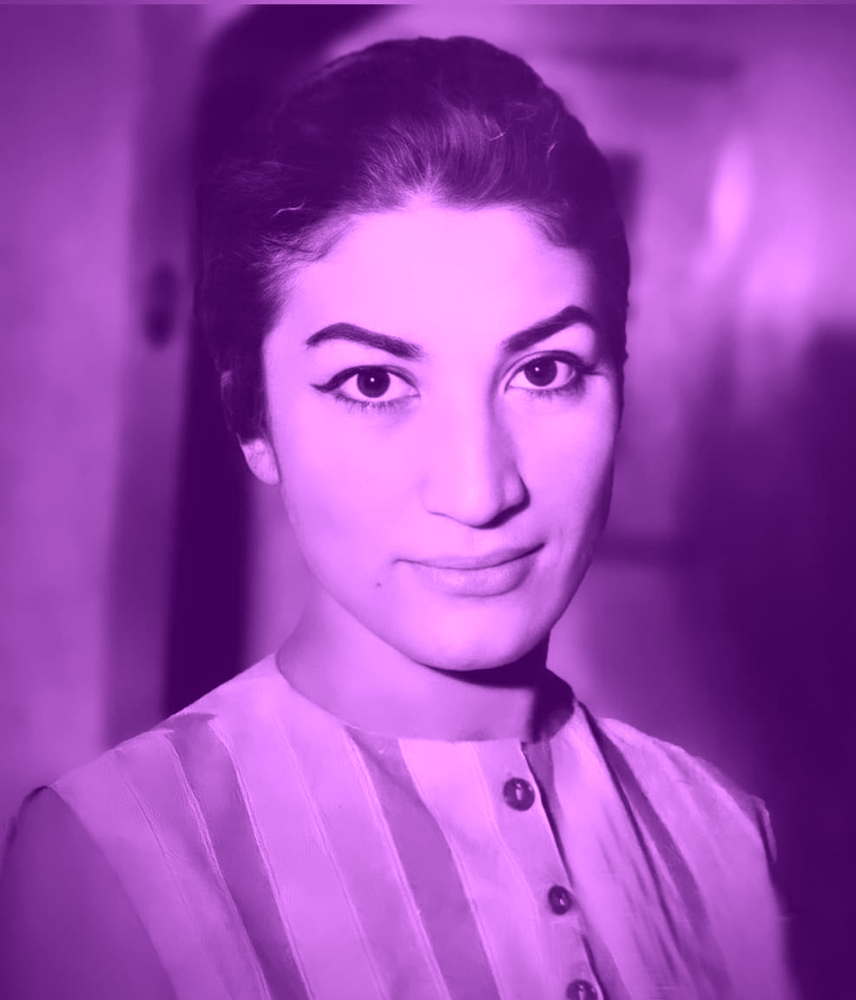
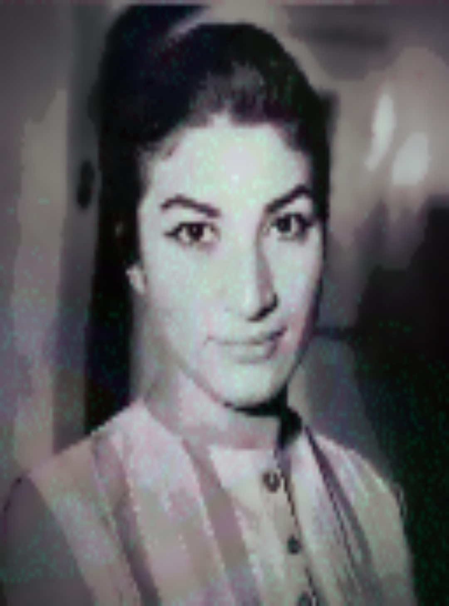
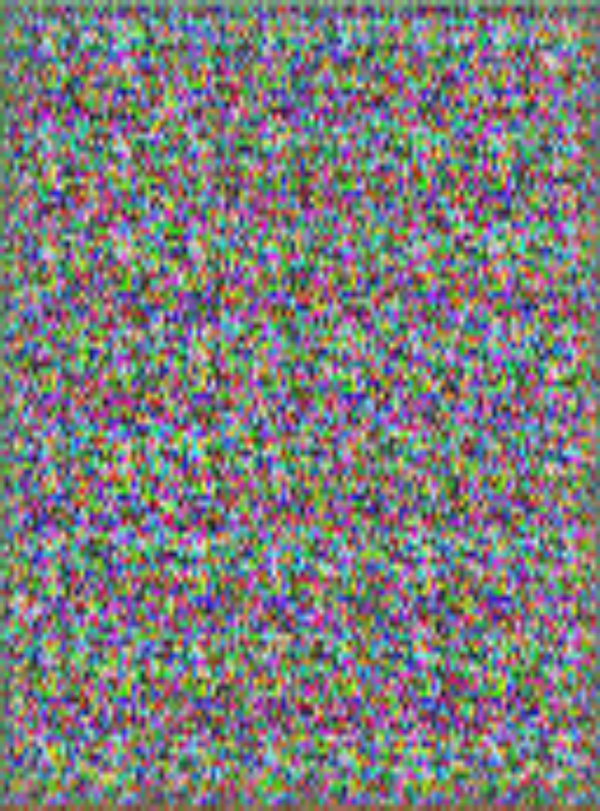
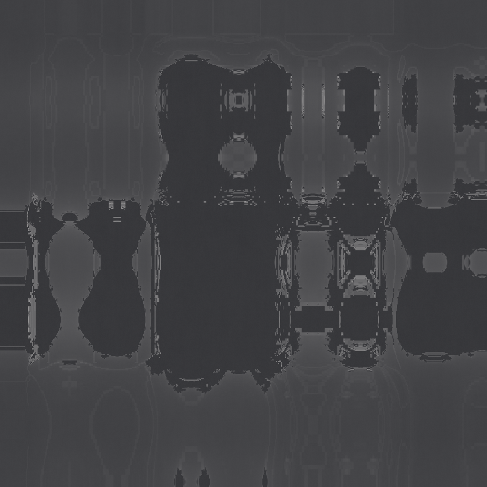
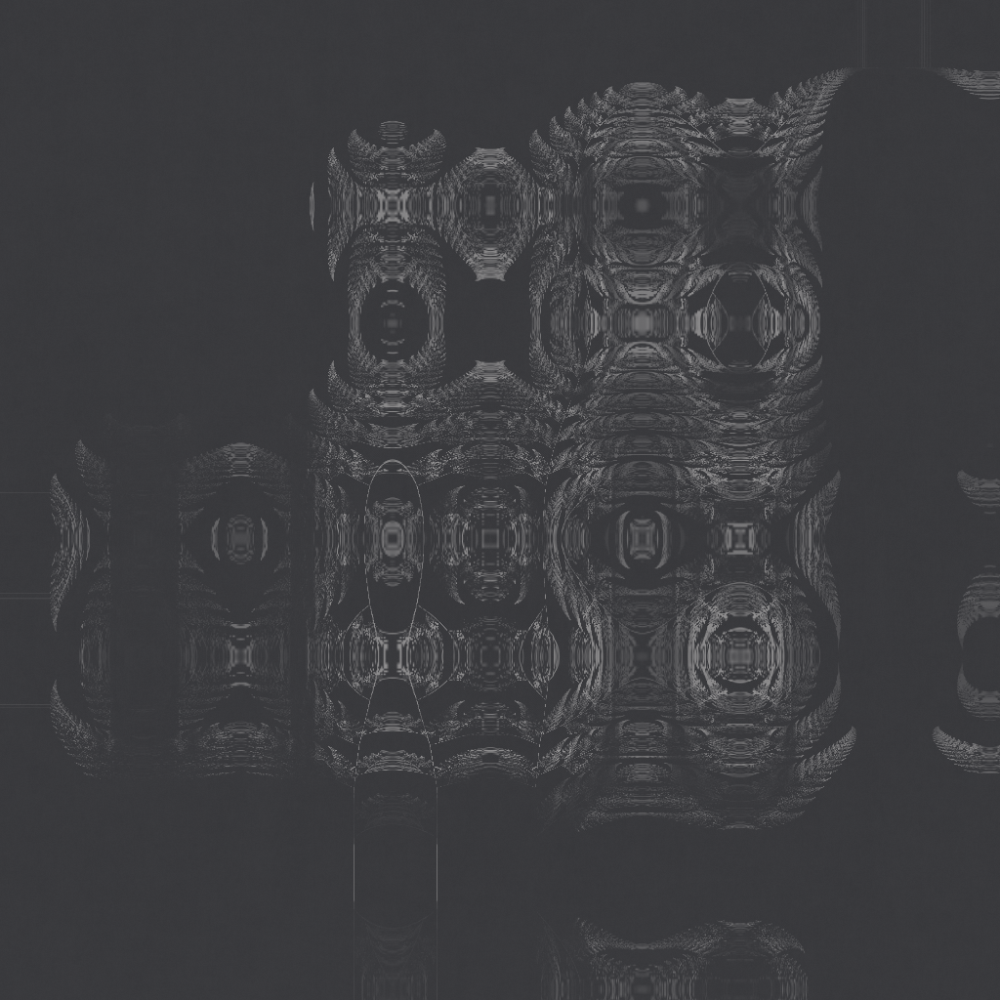
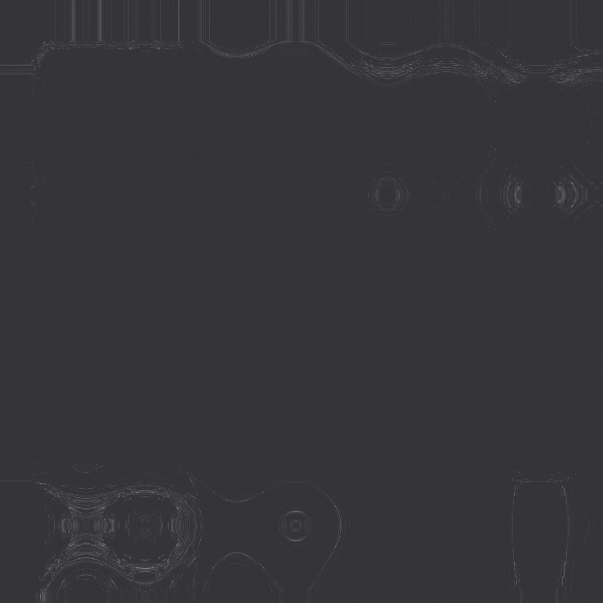
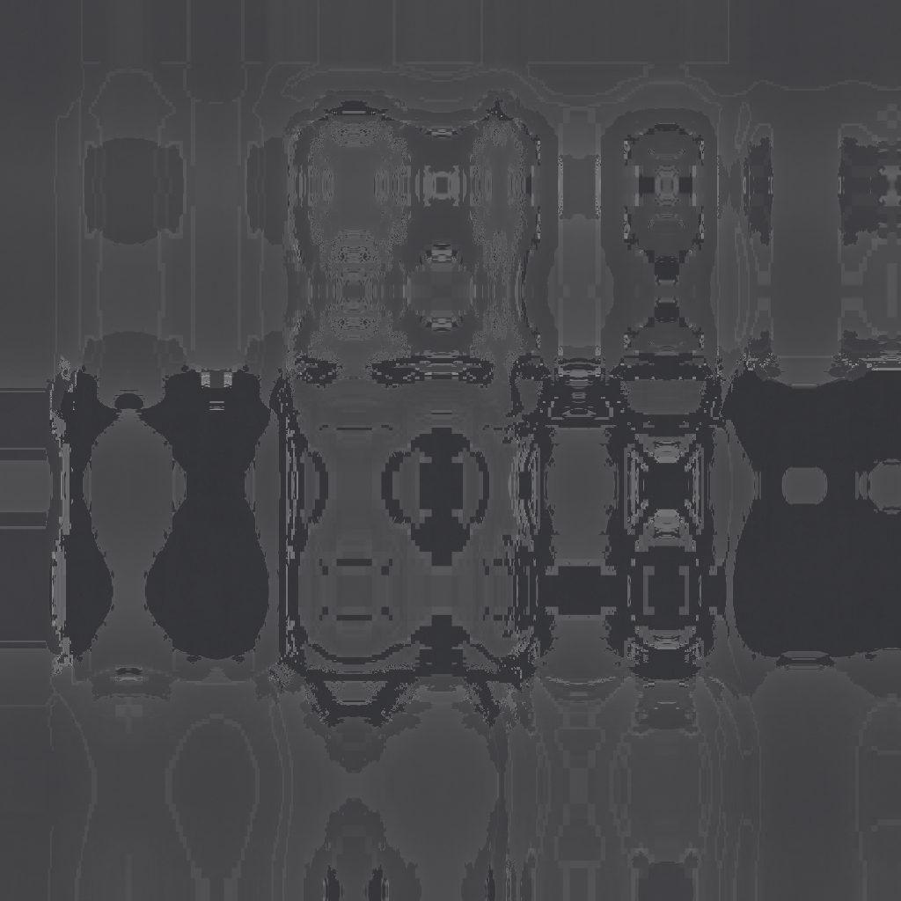

# DHA‑Vision — Generative Art Pipeline (v3)


**Post‑modern, high‑resolution mathematical art from any photograph.**

DHA‑Vision is a Julia‑based pipeline that transforms a small set of input images into a vast gallery of **post‑modern generative art**.  
It combines classical NFT style filters, machine‑learning (PCA & GAN) and a suite of mathematically‑driven generators (fractals, chaotic maps, dynamical systems) with duotone colouring, FFT texture enhancement, and fluid motion warping.  
The result is a collection of **1024×1024**, harsh, minimalist artworks that retain a visual connection to the original photograph.

---

## ✨ Features

- **10 classical image styles** – cyberpunk, vaporwave, glitch, oil, pop art, etc.
- **PCA latent‑space variations** – new images created by exploring the principal components of the input + style set.
- **DCGAN generative model** – a convolutional GAN trained on the image collection, capable of producing novel images.
- **Smart retraining** – the pipeline detects whether the input directory has changed; if not, it loads pre‑trained PCA/GAN models and skips the lengthy training step.
- **9 image‑conditioned mathematical generators** that use the source image as a **parameter field** rather than a mere palette:
  - Julia fractal
  - Burning Ship fractal
  - Orbit‑trap fractal
  - Chaos‑game IFS (Barnsley fern)
  - Markov texture synthesis
  - Gradient‑guided random walk
  - Chirikov (standard) map
  - Hénon map
  - Logistic bifurcation diagram
- **Duotone palette** – a two‑colour palette is automatically extracted from each source image, giving the entire output a cohesive, editorial feel.
- **FFT high‑frequency boost** – edges and fine structures are emphasised in the frequency domain, adding grit and contrast.
- **Fluid motion warp** – smooth, semi‑random flow fields distort the generated shapes, making each piece feel alive and unique.
- **Morphisms & composites** – continuous blends between generators, domain‑warped variations, and layered composites produce dozens of extra artworks per input.

---

## 📁 Directory Structure

```
DHA-Vision/
├── input/                 ← place your source images here
├── output/                ← classical NFT styles
├── ml_output/             ← PCA and GAN generated images
├── saved_models/          ← trained PCA, GAN, and input hash
├── fract_output/          ← final mathematical artworks
└── nft_ml_gen2_smart_fft_motion.jl
```

All folders are created automatically on first run.

---

## 🔁 Pipeline Walkthrough

### 1. Classical NFT Styles
Every image in `input/` is processed through 10 hand‑crafted filters (cyberpunk, vaporwave, glitch, pixel, comic, oil, hologram, gold, pop, abstract) and saved to `output/`.

### 2. Smart Retraining
A hash of the input directory (file names, sizes, modification times) is compared with a stored hash.  
- **Unchanged input →** previously saved PCA and GAN models are loaded; no retraining occurs.  
- **New or modified input →** the full PCA fitting and GAN training cycle is executed, new models are saved, and the hash is updated.

### 3. PCA Variations
The principal components of all images (input + styled outputs) are computed. For each input photo, several new images are synthesized by moving in the latent space and reconstructing with the PCA model. These are saved as `ml_pca_*.png`.

### 4. GAN Generation
A lightweight DCGAN is trained on the same image pool. After training, it is used to generate additional novel images (`ml_gan_*.png`).  
*(Note: only the PCA images are used as sources for the mathematical art step.)*

### 5. Image‑Conditioned Mathematical Art
Each PCA image is used to **parameterise** nine different mathematical generators. The image’s luminance, edge, and contrast fields control fractal coefficients, map parameters, IFS probabilities, and more.  
Every generator outputs a **grayscale matrix**.

### 6. Post‑Processing
For each grayscale output:
1. **Duotone palette** is extracted from the source PCA image (two dominant colours via k‑means).
2. **Fluid motion warp** is applied – a smooth, random flow field displaces pixels, adding organic movement.
3. **FFT enhancement** boosts high frequencies for sharper edges and a gritty texture.
4. **Duotone colouring + subtle grain** are applied, yielding the final 1024×1024 artwork.

### 7. Morphisms & Composites
Additional images are created by:
- morphing (linearly blending) between pairs of generators,
- applying a domain‑warp (gradient‑based distortion),
- overlaying multiple generators with screen‑blend composites.

---

## ⚙️ Configuration

All tunable constants are defined at the top of the script:

```julia
FRACT_SIZE          = (1024, 1024)   # output resolution
FFT_BOOST           = 1.8            # high‑frequency amplification
MOTION_STRENGTH     = 0.12           # fluid warp intensity
GAN_EPOCHS          = 30
PCA_COMPONENTS      = 50
# Many more – see the source file for details.
```

The duotone palette, number of PCA variants, map iteration counts, and warp strengths can all be adjusted to taste.

---

## 📦 Requirements

- **Julia 1.9+**
- Packages: `Images`, `ImageIO`, `FileIO`, `ImageFiltering`, `ImageTransformations`, `ImageEdgeDetection`, `Colors`, `Statistics`, `LinearAlgebra`, `Random`, `MultivariateStats`, `Flux`, `BSON`, `Zygote`, `FFTW`

Install them with:
```julia
using Pkg
Pkg.add(["Images", "ImageIO", "FileIO", "ImageFiltering", "ImageTransformations", "ImageEdgeDetection", "Colors", "Statistics", "LinearAlgebra", "Random", "MultivariateStats", "Flux", "BSON", "Zygote", "FFTW"])
```

---

## 🚀 Usage

1. Place your source photographs (`.jpg`, `.png`, etc.) into the `input/` folder.
2. Run the script:
   ```bash
   julia nft_ml_gen2_smart_fft_motion.jl
   ```
3. The first run will train PCA and GAN (may take several minutes). Subsequent runs with the same input will skip training and use the saved models.
4. Find the generated art in:
   - `output/` — classical styles
   - `ml_output/` — PCA and GAN images
   - `fract_output/` — final mathematical artworks

---

## 🖼️ Sample Outputs

Below are representative examples of each image type produced by the pipeline.

### 🖌️ Input
| Original Photo |
|:---:|
|  |
| `input/Forough_Farrokhzad_804a.jpg` |
| *The source photograph that drives the entire generation process.* |

### 🎨 Classical Styles (output/)
| Cyberpunk | Vaporwave |
|:---:|:---:|
|  |  |
| `output/Forough_Farrokhzad_804a_cyberpunk.png` | `output/Forough_Farrokhzad_804a_vaporwave.png` |
| *Neon‑edged, high‑contrast re‑colouring.* | *Soft pink/blue wash with lifted colours.* |

### 🧪 ML Outputs (ml_output/)
| PCA Variation | GAN Generated |
|:---:|:---:|
|  |  |
| `ml_output/ml_pca_Forough_Farrokhzad_804a_1.png` | `ml_output/ml_gan_Forough_Farrokhzad_804a_1.png` |
| *Latent‑space exploration; subtle blend of input and style features.* | *Novel image synthesised by the trained DCGAN.* |

### 🌀 Mathematical Art (fract_output/)
| Julia Fractal | Chaos‑Game IFS | Chirikov Map | Morph (Julia ↔ Ship) |
|:---:|:---:|:---:|:---:|
|  |  |  |  |
| `fract_ml_pca_Forough_Farrokhzad_804a_1_julia.png` | `fract_ml_pca_Forough_Farrokhzad_804a_1_ifs.png` | `fract_ml_pca_Forough_Farrokhzad_804a_1_chirikov.png` | `fract_ml_pca_Forough_Farrokhzad_804a_1_morph_js_2.png` |
| *Fluid, swirling escape‑time structure tinted with duotone palette.* | *Delicate fern built from image‑conditioned probabilities.* | *Density plot of the standard map, sharpened by FFT.* | *Smooth interpolation between Julia and Burning Ship forms.* |

---

## 📜 License

**Proprietary – all rights reserved.**  
This code is not open‑source. Redistribution, modification, and commercial use require explicit permission.

---

*“Where mathematics meets the photograph.”*  
**DHA‑Vision v3** – a generative art engine by the DHA lab.
