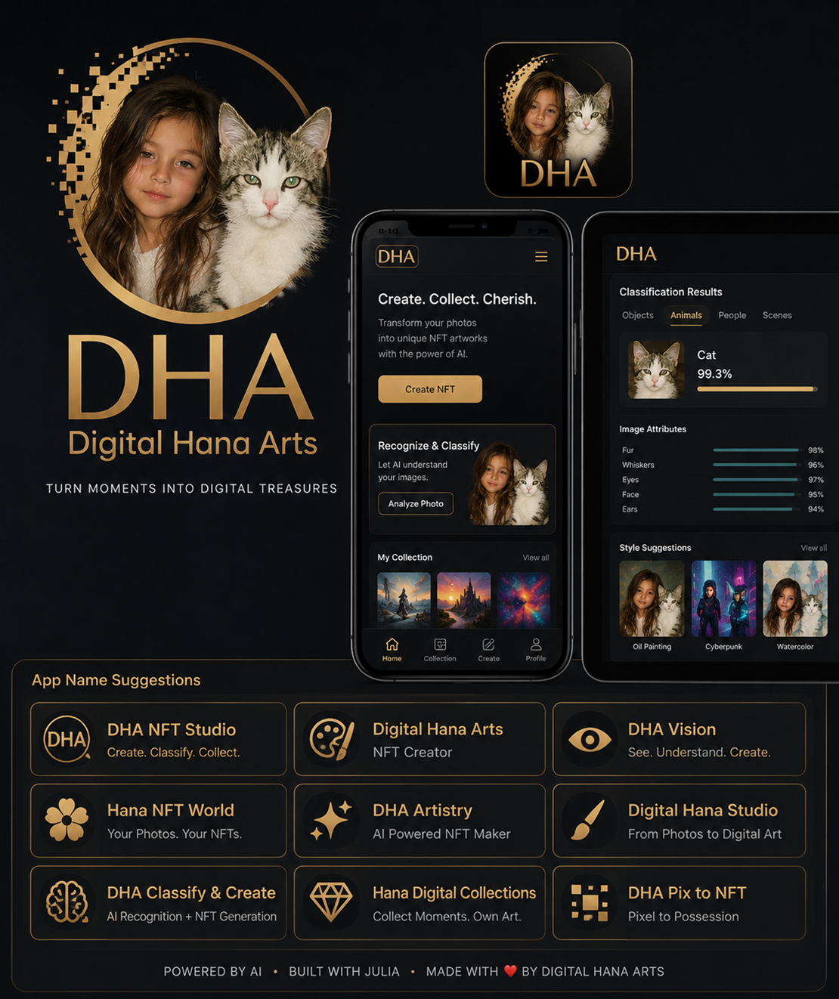
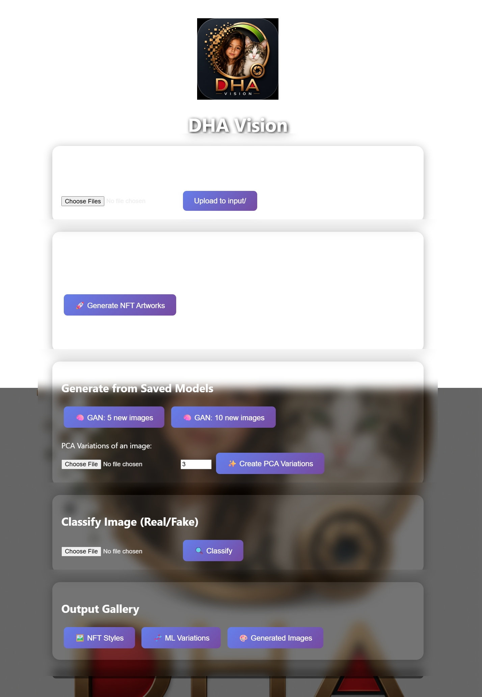
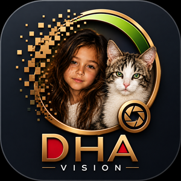

---
---



------
# DHA Vision


**NFT & ML Art Generation Suite**  
*by [Digital__Hana__Arts®](https://github.com/DigitalHanaArts)*  
*Authors: Ali Deragschan, Ali Bavarcci*

[](https://julialang.org/)
[](./LICENSE)

DHA Vision is a desktop application for experimenting with AI-assisted digital art creation. Starting from a single photo, it can transform images into a variety of NFT-inspired artistic styles, learn visual patterns from generated artwork, and create entirely new images using a built-in machine learning pipeline.

Everything runs locally on your computer, so once the application is installed, no internet connection is needed to generate artwork or train models.

---

## ✨ Features

- **10 artistic NFT-inspired styles** including Cyberpunk, Vaporwave, Glitch, Pixel Art, Comic, Oil Painting, Holographic, Gold Foil, Pop Art, and Abstract.
- **Built-in machine learning pipeline** combining PCA for feature extraction with a DCGAN for generating original artwork.
- **Image authenticity prediction** using the trained discriminator to classify generated images.
- **Simple browser-based interface** for uploading images, generating artwork, viewing results, and downloading your favorites.
- **Standalone application** built with PackageCompiler.jl, allowing the software to run without requiring a separate Julia installation.

---

## 🚀 How it works

The workflow is designed to be straightforward:

1. Upload a photo.
2. Choose one of the available artistic styles.
3. Generate a stylized NFT-inspired version of the image.
4. Train the machine learning model on the generated artwork.
5. Create entirely new images inspired by the learned visual style.

Whether you're experimenting with generative art, exploring GANs, or simply creating unique digital artwork, DHA Vision brings the entire workflow together in a single application.

---

## 📂 Project Structure
```
DHA_Vision/
├── DHA_Vision.jl
├── nft_ml_gen2.jl
├── generate_from_models.jl
├── input/
├── output/
├── ml_output/
├── generated_images/
├── saved_models/
├── DHA_Vision_ScreenShot.jpeg
├── DHA_Vision_logo.png
├── DHA_Vision.png
├── Project.toml
├── Manifest.toml
├── License.txt
└── README.md
```

---

## 🚀 Quick Start (development mode)

### Prerequisites
- [Julia 1.9.4](https://julialang.org/downloads/)
- All required packages (see `Project.toml`)

### 1. Clone the repository
```bash
git clone https://github.com/DigitalHanaArts/DHA_Vision.git
cd DHA_Vision
```

### 2. Install dependencies
```bash
julia --project=. -e 'import Pkg; Pkg.resolve(); Pkg.instantiate()'
```

### 3. Launch the web application
```bash
julia --project=. -e 'import DHAVision; DHAVision.start_server()'
```

Open your browser at **http://localhost:8080**.

---

## 📦 Building a Standalone Executable

To distribute the app without requiring Julia, build a self‑contained bundle with `PackageCompiler`:

```julia
using PackageCompiler
create_app(
    ".",
    "DHA_Vision_App",
    precompile_execution_file = joinpath("src", "DHAVision_main.jl"),
    force = true,
    include_lazy_artifacts = true,
)
```

The resulting `DHA_Vision_App` folder contains the executable and all assets.  
Just double‑click `DHAVision.exe` (Windows) or run `./DHAVision` (macOS/Linux) – no Julia required.

---

---

## 📄 License

This project is proprietary software.  
Contact **Digital__Hana__Arts** for licensing inquiries.

---

## 🤝 Contributing

This is a closed‑source project. Contributions are not currently accepted.

---

## 📧 Contact

**Digital__Hana__Arts**  
Authors: Ali Deragschan, Ali Bavarcci  
Email: [contact@digitalhanaarts.com](mailto:digital.hana.arts@gmail.com)

---

*Built with ❤️ and Julia 1.9.4*
```
